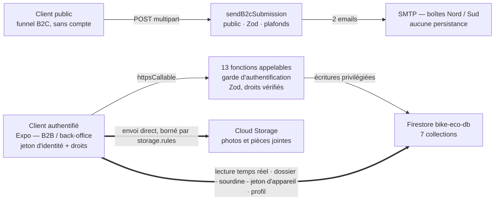

# Application Bike-eco — documentation technique et fonctionnelle

Plateforme de reprise de véhicules deux-roues : funnel public pour les particuliers,
espace concessionnaire, back-office de traitement des dossiers. Une base de code Expo
pour iOS, Android et web, adossée à Firebase, hébergée à Paris.

| | |
|---|---|
| **Produit** | Bike-eco 1.0.0 |
| **Dépôt** | `bike-eco` @ `main` |
| **Commit de référence** | `e18f6f1` |
| **Projet Firebase** | `bike-eco-43a84` |
| **Région** | `europe-west9` |
| **Période de développement** | 12 juin – 4 septembre 2026 |
| **Historique** | 463 commits / 43 jours |
| **Édition du document** | 4 septembre 2026 |

| Volume | |
|---|---|
| Écrans applicatifs | 31 |
| Étapes de formulaire | 21 |
| Champs validés | 81 |
| Fonctions serveur | 18 |
| Composants d'interface | 59 |
| Tests automatisés | 519 |
| Collections Firestore | 7 |
| Documents légaux | 3 |

---

## Sommaire

1. [Objet et méthode](#01--objet-et-méthode)
2. [Périmètre fonctionnel](#02--périmètre-fonctionnel)
3. [Modèle de données](#03--modèle-de-données)
4. [Inventaire des écrans](#04--inventaire-des-écrans)
5. [Formulaires et validation](#05--formulaires-et-validation)
6. [Fonctions transverses](#06--fonctions-transverses)
7. [Architecture technique](#07--architecture-technique)
8. [Qualité et sécurité](#08--qualité-et-sécurité)
9. [Conformité RGPD](#09--conformité-rgpd)
10. [Documentation et exploitation](#10--documentation-et-exploitation)
11. [Points ouverts et écarts constatés](#11--points-ouverts-et-écarts-constatés)
12. [Annexes](#12--annexes)

---

## 01 — Objet et méthode

Ce document décrit ce que l'application Bike-eco fait, comment elle est construite, et
où chaque affirmation est vérifiable dans le code. Il est destiné au commanditaire, à un
futur prestataire qui reprendrait le produit, et à toute personne devant rendre compte du
traitement des données personnelles.

### Méthode

Chaque chiffre et chaque règle de ce document a été relevé dans le dépôt au commit
`e18f6f1`, et non repris d'un document antérieur. Les compteurs de tests proviennent d'une
exécution réelle de la suite ; les compteurs d'écrans, de champs et de fonctions d'un
dénombrement des fichiers et des schémas. Quand le code et une documentation interne
divergent, **le code fait foi** et l'écart est consigné au chapitre 11.

Pour rendre l'ensemble auditable, chaque chapitre porte une **ligne de provenance** qui
nomme les fichiers contre lesquels il a été vérifié :

> **Vérifié dans** — `package.json` · `app.json` · `firebase.json` · `.firebaserc` · `git log`

### Ce que ce document ne couvre pas

- Le **manuel d'utilisation** destiné aux concessionnaires et à l'équipe Bike-eco : ce
  document décrit les mécanismes, pas les gestes.
- Les **conditions commerciales** (chiffrage, maintenance, cession des droits) : elles
  relèvent du devis DEV-BE-2026-02, dont ce document est le pendant technique.
- Le **contenu juridique** des trois documents légaux, reproduits dans `docs/legal/` et
  dont seules la structure et la mise en œuvre applicative sont décrites ici.

---

## 02 — Périmètre fonctionnel

Trois parcours indépendants, qui ne partagent ni leurs règles d'accès, ni leur modèle de
persistance, ni leur mode de notification. La distinction structurante : le parcours
particulier ne persiste rien, les deux autres travaillent sur des dossiers stockés.

> **Vérifié dans** — `docs/product/bike-eco-app.md` · `src/app/**/*.tsx` ·
> `src/lib/firestore/schema.ts` · `functions/src/**`

| Parcours | Acteur | Authentification | Persistance | Notification |
|---|---|---|---|---|
| **A — Particuliers** | Grand public | Aucune | Aucune — transactionnel | 2 emails |
| **B — Concessionnaires** | Garage, concession | Compte `b2b`, validé manuellement | Dossiers, messages, photos | Push + emails |
| **C — Back-office** | Équipe Bike-eco | Compte `backoffice` | Lecture / gestion de tous les dossiers | Push + emails |

### 2.1 — Parcours A : soumission publique (B2C)

- **Funnel de 9 étapes, 35 champs**, accessible sans compte : coordonnées, véhicule
  électrique, informations véhicule, clés et télécommandes, état, papiers, photos, prix
  souhaité, modalités de reprise.
- **Champs conditionnels** : les sous-questions (matériel de recharge, éléments keyless,
  nature de la panne, résultat du contrôle technique) n'apparaissent que si la question
  parente le justifie, et sont *purgées à la validation* si l'utilisateur revient en
  arrière — la normalisation `clearUnaskedCheckboxes` s'exécute côté client et est
  **rejouée côté serveur**.
- **Photos** : 1 à 10, redimensionnées avant envoi, plafonnées à 8 Mo l'unité par le point
  d'entrée, seuls les types `image/*` étant acceptés.
- **Deux emails HTML** à la soumission : le dossier complet avec photos en pièces jointes à
  l'équipe (envoyé en premier, car c'est l'email opérationnellement critique), puis le
  récapitulatif au particulier.
- **Routage géographique** de l'email équipe : 52 départements vers la boîte Nord (centre
  de Pressigny-les-Pins), 44 vers la boîte Sud (centre de Vitrolles), Corse comprise. Un
  département inconnu ou vide bascule sur Nord, pour qu'une demande ne soit jamais perdue.
- **Aucune écriture en base.** La demande n'existe que sous forme d'email : il n'y a rien à
  supprimer, rien à sécuriser en lecture, et rien à conserver.

### 2.2 — Parcours B : espace concessionnaire

- **Inscription entreprise en 3 étapes** : SIRET à 14 chiffres et numéro de TVA
  intracommunautaire optionnel, création du compte, coordonnées. Un SIRET déjà enregistré
  est refusé. Le compte et l'entreprise naissent au statut `pending`.
- **Validation manuelle** par l'équipe Bike-eco. Tant qu'elle n'est pas faite, le compte
  n'accède qu'à un écran d'attente — qui est aussi l'endroit où la permission de
  notification est demandée, pour que l'utilisateur soit prévenu de sa propre activation.
- **Invitation d'un collègue** : code à 6 caractères alphanumériques tiré au sort
  cryptographiquement, envoyé par email, stocké uniquement sous forme de hash SHA-256,
  **valable une heure**, à usage unique, supprimé à l'acceptation.
- **Tableau de bord** en deux sections — « Dossiers en cours » (qui fusionne les états
  `a_traiter` et `en_cours`) et « Dossiers clos ».
- **Formulaire « Vendre une moto » en 7 étapes, 28 champs** : le funnel véhicule sans
  l'étape coordonnées, avec en plus la question « véhicule déjà en stock » et une fusion de
  « Modèle et Cylindrée » en un seul champ.
- **Fiche dossier** : carrousel des photos, badge de statut, et l'ensemble des réponses du
  formulaire en liste compacte.
- **Messagerie** par dossier avec l'équipe Bike-eco, pièces jointes photo et PDF, mise en
  sourdine par dossier.
- **Gestion d'équipe** : promotion et rétrogradation d'administrateur, suppression d'un
  collègue, suppression de son propre compte — un administrateur ne pouvant être ni
  supprimé, ni se supprimer, et le dernier administrateur ne pouvant être rétrogradé.
- **Modification de ses informations personnelles** — nom, prénom, téléphone — depuis
  « Mon compte », un champ à la fois. L'email n'est pas modifiable : il est l'identifiant du
  compte.

### 2.3 — Parcours C : back-office Bike-eco

- **Tableau de bord** en trois sections : « Dossiers à traiter », « Dossiers en cours »,
  « Dossiers clos ».
- **Filtre par région** — Moitié Nord, Moitié Sud, Toute la France. Il est stocké *sur le
  compte* (`users/{uid}.notificationRegion`), pas sur l'appareil : le serveur diffuse les
  notifications selon ce même champ, si bien qu'un membre ne peut pas surveiller le Nord à
  l'écran tout en étant alerté sur le Sud.
- **Gestion du dossier** : statut, région attribuée, prix d'achat validé, suppression
  définitive.
- **Email récapitulatif** d'un dossier, envoyé à la demande — et uniquement à l'adresse du
  demandeur, lue dans Firebase Auth.
- **Gestion des entreprises** : bandeau d'alerte sur les inscriptions en attente, liste,
  fiche détaillée, validation ou refus.
- **Gestion des utilisateurs** : consultation d'un compte concessionnaire, invitation d'un
  membre de l'équipe Bike-eco, suppression.

### 2.4 — Règles métier transverses

#### Statuts d'un dossier, et la projection par rôle

Trois statuts réels existent en base. Le back-office les voit tous ; un concessionnaire en
voit une **projection** — `a_traiter` lui est rendu comme « En cours », parce que « à
traiter » est l'état de travail interne de l'équipe.

| Valeur stockée | Vu par le back-office | Vu par le concessionnaire | Signification |
|---|---|---|---|
| `a_traiter` | À traiter | En cours | Dossier déposé, négociation non entamée |
| `en_cours` | En cours | En cours | Négociation engagée |
| `cloture` | Clôturé | Clôturé | Négociation terminée |

> **La projection gouverne aussi la notification, pas seulement l'affichage.** Un passage
> de `a_traiter` à `en_cours` — dans un sens comme dans l'autre — est invisible pour un
> concessionnaire : son écran affichait « En cours » avant et affiche « En cours » après.
> Le serveur ne lui envoie donc *rien*. Sans cela, il recevrait « Le statut a évolué » à
> propos d'un écran qui n'a pas changé.

#### Régions et rattachement

La région d'un dossier est dérivée du département de l'entreprise qui le dépose, et reste
**réattribuable** par le back-office : c'est une donnée de routage, pas une frontière
d'accès. La frontière d'accès, elle, est le `companyId`.

#### Statuts de compte et droits

| Attribut | Valeurs | Posé par | Porté par |
|---|---|---|---|
| `role` | `b2b` · `backoffice` | Serveur | Custom claim + document |
| `status` | `pending` · `active` | Serveur | Custom claim + document |
| `companyId` | Identifiant, ou `null` en back-office | Serveur | Custom claim + document |
| `isAdmin` | `true` · `false` | Serveur | **Document uniquement** — jamais un claim, pour qu'une promotion prenne effet sans attendre le renouvellement du jeton |

Les trois premiers sont lus depuis le jeton d'identité vérifié, jamais depuis le document :
un profil obsolète ne peut donc pas accorder un accès. Aucun n'est modifiable depuis
l'application.

---

## 03 — Modèle de données

Sept collections dans la base Firestore nommée `bike-eco-db` — et non la base `(default)`,
distinction qui a des conséquences jusque dans les règles de stockage et le déclenchement
des fonctions.

> **Vérifié dans** — `src/lib/firestore/schema.ts` · `src/lib/firestore/collections.ts` ·
> `firestore.indexes.json` · `docs/tech/firestore-data-model.md`

| Collection | Contenu | Écriture cliente |
|---|---|---|
| `companies/{id}` | SIRET (immuable), TVA, raison sociale, statut, département, ville, région, créateur et son nom dénormalisé, date de validation. L'identifiant est `<siret>-<6 caractères>`, lisible dans la console. | Interdite |
| `users/{uid}` | Rôle, entreprise, `isAdmin`, nom, prénom, email, téléphone, statut, région gérée (back-office). | Profil seul — `role`, `companyId`, `status`, `isAdmin` et `createdAt` sont explicitement exclus |
| `users/{uid}/pushTokens/{deviceId}` | Un document par appareil : jeton FCM, plateforme, date. L'identifiant est un identifiant d'appareil tiré une fois, non le jeton — un jeton renouvelé met donc sa ligne à jour au lieu d'en orpheliner une. | Propriétaire seul, forme contrainte |
| `invitations/{id}` | Email, rôle accordé, entreprise, invitant, **hash** du code, date d'expiration. | Interdite — lecture comprise |
| `dossiers/{id}` | Statut, région, entreprise, déposant, dernier modificateur, prix validé, identité dénormalisée du déposant, et six blocs de réponses : véhicule, clés, état, papiers, prix, photos. | Création par le concessionnaire ; mise à jour de 5 champs par le back-office |
| `dossiers/{id}/messages/{id}` | Expéditeur, nom d'expéditeur estampillé par le serveur, rôle, texte, pièces jointes, date. | Interdite — la fonction `sendMessage` est le seul écrivain |
| `dossiers/{id}/mutes/{uid}` | La *présence* du document signifie « en sourdine ». Son absence signifie « abonné ». | Sa propre ligne uniquement |

### Dénormalisations, et pourquoi elles existent

Quatre copies de données sont volontairement maintenues hors de leur source. Chacune répond
à une contrainte de lecture réelle, non à une optimisation de confort :

| Copie | Source | Raison |
|---|---|---|
| `dossiers.submitter` | `users/{uid}` | Un collègue consultant le dossier d'un autre ne peut pas lire son profil : la règle limite la lecture au propriétaire, à l'équipe et aux collègues de la même entreprise. |
| `companies.createdByName` | `users/{uid}` | Sous-titre de la carte entreprise, sans lecture supplémentaire. |
| `messages.senderName` | `users` + `companies` | Un collègue supprimé laisse ses messages lisibles ; c'est la seule copie du nom garantie de survivre. |
| `dossiers.thumbnailUrl` | Première photo | Vignette basse définition pour les listes. |

La conséquence est assumée : la modification de son nom ou de son téléphone est une
**écriture privilégiée** qui réécrit le profil, puis `submitter.*` sur tous les dossiers
déposés par l'utilisateur, puis `createdByName` s'il a créé l'entreprise. Une soumission
sans changement réel n'écrit rien.

### Index et expiration

Cinq index composites, tous dictés par une requête d'écran, plus une politique d'expiration
automatique :

| Index | Sert |
|---|---|
| `dossiers : companyId, status, createdAt` | Les deux sections du tableau de bord concessionnaire |
| `dossiers : status, createdAt` | Back-office, filtre « Toute la France » |
| `dossiers : region, status, createdAt` | Back-office, filtre Nord ou Sud |
| `companies : status, createdAt` | Entreprises en attente de validation |
| `companies : status, validatedAt` | Entreprises actives, plus récentes d'abord |
| `invitations.expiresAt` → TTL | Balayage automatique des invitations jamais utilisées |

> La contrainte `companyId` de la requête concessionnaire n'est pas une optimisation : la
> règle de lecture est `resource.data.companyId == myCompany()`, et Firestore refuse toute
> requête de liste dont il ne peut pas prouver statiquement qu'elle la satisfait.

---

## 04 — Inventaire des écrans

31 écrans répartis en trois groupes de routes, plus 8 fichiers de disposition qui portent
les en-têtes et les barres d'onglets. Les étapes internes des formulaires — 21 au total —
ne sont pas des écrans distincts et sont détaillées au chapitre 5.

> **Vérifié dans** — `src/app/**/*.tsx` (31 routes, 8 layouts) · `docs/specs/page-*.md`

### Public — accessible sans compte (7)

| Écran | Route | Rôle et contenu |
|---|---|---|
| Accueil | `/` | Point d'entrée « Qui êtes-vous ? », redirection selon la session |
| Funnel particulier | `/b2cSubmissionForm` | Formulaire public en 9 étapes + écran de confirmation animé |
| Connexion | `(auth)/signin` | Email / mot de passe, connexion Google, mot de passe oublié |
| Inscription entreprise | `(auth)/register` | Funnel 3 étapes : entreprise, compte, coordonnées |
| Code d'invitation | `(auth)/invite-code` | Saisie du code à 6 caractères reçu par email |
| Inscription sur invitation | `(auth)/register-invited` | Funnel 2 étapes, email pré-rempli et verrouillé |
| Compte en attente | `(auth)/pending` | Attente de validation ; demande la permission de notification |

### Espace concessionnaire (10)

| Écran | Route | Rôle et contenu |
|---|---|---|
| Tableau de bord | `(b2b)/(tabs)/dashboard` | Dossiers en cours et clos, bouton « Vendre une moto » |
| Vendre une moto | `(b2b)/vehicule-submission` | Funnel de soumission en 7 étapes |
| Fiche dossier | `(b2b)/dossier/[id]` | Carrousel, badge de statut, informations du véhicule |
| Messagerie | `(b2b)/dossier/[id]/chat` | Fil temps réel, pièces jointes, mise en sourdine |
| Mon compte | `(b2b)/(tabs)/account` | Informations personnelles et entreprise, mot de passe |
| Paramètres | `(b2b)/(tabs)/settings` | Équipe, invitation, déconnexion, suppression du compte |
| Inviter un collègue | `(b2b)/add-colleague` | Saisie de l'email, envoi du code |
| Fiche collègue | `(b2b)/colleagues/[uid]` | Informations, promotion / rétrogradation, suppression |
| Modifier mes informations | `(b2b)/edit-profile` | Édition d'un champ — nom, prénom ou téléphone |
| Confirmation | `(b2b)/confirmation` | Écran de succès générique à redirection différée |

### Back-office Bike-eco (14)

| Écran | Route | Rôle et contenu |
|---|---|---|
| Tableau de bord | `(backoffice)/(tabs)/dashboard` | Trois sections, filtre région, alerte inscriptions |
| Fiche dossier | `(backoffice)/dossier/[id]` | Vue complète, coordonnées cliquables, email récapitulatif |
| Gestion du dossier | `(backoffice)/dossier/[id]/management` | Statut, région attribuée, prix validé, suppression |
| Messagerie | `(backoffice)/dossier/[id]/chat` | Fil avec le concessionnaire |
| Liste des entreprises | `(backoffice)/companies` | Entreprises en attente et actives |
| Fiche entreprise | `(backoffice)/companies/[id]` | SIRET, TVA, localisation, validation ou refus |
| Fiche utilisateur | `(backoffice)/users/[uid]` | Consultation d'un compte concessionnaire |
| Mon compte | `(backoffice)/(tabs)/account` | Informations du membre de l'équipe |
| Paramètres | `(backoffice)/(tabs)/settings` | Région gérée, équipe, déconnexion |
| Inviter un membre | `(backoffice)/add-colleague` | Invitation d'un collaborateur Bike-eco |
| Fiche membre | `(backoffice)/colleagues/[uid]` | Informations, droits, suppression |
| Modifier mes informations | `(backoffice)/edit-profile` | Édition d'un champ personnel |
| Invitation envoyée | `(backoffice)/invite-sent` | Confirmation d'envoi |
| Confirmation | `(backoffice)/confirmation` | Écran de succès générique |

> **Les deux espaces partagent leurs écrans, pas leurs routes.** Le corps de chaque écran
> vit une seule fois dans `src/components/screens/`, paramétré par le rôle et par des
> rappels de navigation. Les fichiers de `src/app/` sont de fines enveloppes qui injectent
> le groupe de routes. C'est ce qui permet à un changement de mise en page de rester
> synchrone entre B2B et back-office — et c'est aussi pourquoi le nombre de fichiers de
> route dépasse le nombre d'écrans réellement conçus.

---

## 05 — Formulaires et validation

Quatre funnels reposent sur un moteur commun : un schéma Zod, une description déclarative
des étapes, un gestionnaire de soumission. Les règles de validation sont écrites une fois
et servent à l'affichage des erreurs comme au rejet des données.

> **Vérifié dans** — `src/features/*/schema.ts` · `steps.tsx` · `src/lib/forms/useStepForm.ts` ·
> `src/constants/vehicle.ts` · `functions/src/payload.ts` · `docs/specs/form-*.md`

| Funnel | Étapes | Champs | Aboutissement |
|---|---:|---:|---|
| Soumission publique B2C | 9 | 35 | Deux emails, aucune persistance |
| « Vendre une moto » (B2B) | 7 | 28 | Un dossier + ses photos dans Storage |
| Inscription entreprise | 3 | 11 | Compte Auth, entreprise, profil — tous en attente |
| Inscription sur invitation | 2 | 7 | Compte actif immédiatement |
| **Total** | **21** | **81** | |

### Règles de validation notables

| Champ | Règle | Motif |
|---|---|---|
| SIRET | Exactement 14 chiffres | Identifiant de l'entreprise, unique — un doublon est refusé |
| TVA | Optionnel ; `FR` + clé à 2 caractères + les 9 chiffres du SIREN, **vérifiés cohérents avec le SIRET** | Une TVA qui ne correspond pas au SIRET saisi est une faute de frappe, pas une variante |
| Téléphone | Exactement 10 chiffres | Même règle à l'inscription et à la modification du profil |
| Email | Format valide, 254 caractères | Longueur maximale d'une adresse selon la RFC 5321 |
| Mot de passe | 8 caractères minimum | Vérifié côté serveur ; l'erreur Firebase est retraduite en français |
| Immatriculation | 15 caractères, aucun format imposé | Le funnel accepte les véhicules étrangers et non encore immatriculés |
| Textes courts | 120 caractères | Marque, modèle, ville, nom, nature de la panne |
| Textes libres | 2 000 caractères | Accessoires, commentaires |
| Nombres | 9 chiffres | Cylindrée, année, kilométrage, prix — saisis en chiffres seuls |
| Photos | 1 à 10, 8 Mo l'unité en B2C, 10 Mo dans Storage | Plafond appliqué dans le sélecteur, dans le schéma, et au point d'entrée |

### La double validation

Le point d'entrée public est le seul de l'application accessible sans authentification. Il
ne fait donc *aucune* confiance au client : le schéma serveur reprend chaque champ,
replafonne chaque chaîne, et rejoue la normalisation des cases à cocher conditionnelles.
Le raisonnement est explicite dans le code — sans plafond par champ, une « marque » de
100 ko passerait la limite globale de la requête et se retrouverait insérée dans un email
illisible.

Les valeurs constantes qui doivent coïncider de part et d'autre (plafonds de longueur,
libellés des cases, table des départements) sont **volontairement dupliquées** entre
l'application et les fonctions, parce que le paquet `functions/` compile isolément et ne
peut pas importer les sources de l'application. Chaque duplication porte un commentaire qui
nomme sa contrepartie et impose la mise à jour conjointe.

---

## 06 — Fonctions transverses

Les briques qui traversent les trois parcours, et où se concentre l'essentiel de la
complexité.

> **Vérifié dans** — `src/lib/auth/**` · `src/lib/notifications/**` ·
> `functions/src/notifications/**` · `functions/src/messages/**` · `src/lib/storage/**` ·
> `functions/src/email.ts` · `src/theme/tokens.ts`

### 6.1 — Authentification et droits

- Email / mot de passe et **connexion Google** sur iOS, Android et web. Les entrées Apple
  et Facebook existent dans le composant mais sont commentées : les activer est un travail
  de configuration, pas de code.
- **Mot de passe oublié** depuis l'écran de connexion, et changement de mot de passe depuis
  « Mon compte », par email de réinitialisation Firebase.
- **Aucune énumération d'adresses** : une demande de réinitialisation renvoie le même
  message qu'une adresse soit connue ou non.
- **Connexion Google ≠ inscription** : une identité Google sans profil Bike-eco est
  refusée, et le compte Auth que la tentative vient de créer est supprimé plutôt que laissé
  dormant.
- **Garde de navigation** pure et testée : tant que la session n'est pas résolue, aucun
  écran protégé ne s'affiche ; une fois résolue, l'utilisateur est redirigé vers l'espace de
  son rôle depuis n'importe quelle page.
- **Détection de suppression et d'activation** : la surveillance du document de profil
  signale à l'appareil qu'un compte a été supprimé (le jeton d'identité, lui, resterait
  valable jusqu'à une heure) ou qu'il vient d'être validé, ce qui déclenche la relecture des
  droits sans attendre un redémarrage.
- **Messages d'erreur en français** pour chaque code d'échec, y compris la limitation de
  débit et les pannes réseau.

### 6.2 — Notifications push

Cinq événements, deux rôles destinataires. Le serveur émet directement vers FCM depuis
quatre déclencheurs Firestore ; l'appareil reçoit, présente et route.

| Événement | Destinataires | Titre de la notification |
|---|---|---|
| Inscription d'une entreprise | Back-office de la région concernée | 1 nouvelle entreprise s'est inscrite |
| Nouveau dossier | Back-office de la région concernée | Une nouvelle proposition d'achat vient d'être publié. |
| Nouveau message | Back-office de la région, *et* — seulement si l'expéditeur est le back-office — les membres actifs de l'entreprise ; moins l'expéditeur, moins les mises en sourdine | 1 nouveau message de `{expéditeur}` / de Bike-eco |
| Changement de statut | Back-office de la région + membres actifs de l'entreprise ; moins l'auteur, les sourdines, et ceux pour qui le changement est invisible | Le statut de la `{moto}` a évolué |
| Changement de prix validé | Même ensemble candidat | Le prix validé de la `{moto}` a évolué |

- **Un compte en attente n'est jamais destinataire** — le filtre est côté serveur, sur le
  statut du profil. Il peut donc enregistrer son appareil dès la connexion, ce qui est
  précisément ce qui lui permet d'être prévenu de sa propre validation.
- **Abonné par défaut, sans écriture** : la sourdine est matérialisée par la présence d'un
  document. Rien à créer à la naissance d'un dossier, rien à rétro-remplir.
- **Une seule bannière par message** en premier plan, et trois points d'entrée de clic
  distincts (démarrage à froid, application en arrière-plan, bannière en premier plan) qui
  alimentent le même mécanisme de routage.
- **Gestion multi-appareils** : envoi groupé par jeton et non par ligne, purge des jetons
  morts, ramassage des lignes orphelines à la connexion suivante.
- Une soumission de gestion qui modifie à la fois le statut et le prix envoie **deux**
  notifications, conformément à la spécification.

### 6.3 — Messagerie et pièces jointes

- Un fil par dossier, en temps réel, entre le concessionnaire et l'équipe Bike-eco.
- **Le client n'écrit jamais un message.** Les règles interdisent la création ; une fonction
  serveur est le seul écrivain et estampille elle-même l'expéditeur sous la forme
  « Prénom Nom - Entreprise » ou « Prénom Nom - Bike-eco ».
- Pièces jointes photo et PDF, visionneuse plein écran avec zoom.
- **Bornes appliquées** : 4 096 caractères par message, 5 pièces jointes, 10 Mo par fichier,
  types de fichiers énumérés — `image/svg+xml` est délibérément exclu, car un SVG peut
  porter un script exécuté si l'URL du fichier est ouverte comme navigation.
- **Vérification de provenance des pièces jointes** : l'URL fournie doit pointer dans le
  dossier de messages de *ce* dossier, dans notre propre espace de stockage. Un lien
  externe, ou un lien vers l'espace d'une autre entreprise, est refusé.
- Un identifiant de message rejoué ne peut pas écraser un message existant.

### 6.4 — Photos et fichiers

- Sélection depuis la galerie ou prise de vue, vignette générée à 400 px pour les listes.
- Arborescence de stockage préfixée par entreprise — `dossiers/{entreprise}/{dossier}/…` —
  ce qui permet aux règles d'autoriser depuis les seuls droits du jeton, et à une
  suppression de dossier de tout balayer en une opération préfixée.
- Un envoi injoignable échoue en 20 secondes plutôt qu'après deux minutes de tentatives,
  pour que l'erreur remonte vite à l'utilisateur.
- La suppression d'un dossier, d'une entreprise ou d'un compte efface les fichiers *avant*
  les documents : un fichier orphelin n'est visible nulle part, alors qu'un document dont
  les images manquent est visible et réparable.

### 6.5 — Emails transactionnels

| Email | Déclencheur | Destinataire |
|---|---|---|
| Dossier complet, photos jointes | Soumission publique | Boîte Nord ou Sud, selon le département |
| Récapitulatif de la demande | Soumission publique | Le particulier |
| Demande d'inscription reçue | Inscription entreprise | Le demandeur |
| Votre compte est validé | Validation par le back-office | Le demandeur |
| Vous êtes invité (+ code) | Invitation d'un collègue ou d'un membre | L'invité |
| Récapitulatif d'un dossier | Bouton sur la fiche dossier | **Uniquement** l'adresse Auth du demandeur |

Le transport SMTP est mutualisé et mis en cache entre les invocations ; ses identifiants
sont des secrets Firebase, jamais des variables de configuration. En l'absence de secrets —
sur l'émulateur — les emails sont composés et journalisés au lieu d'être envoyés, ce qui
rend le parcours complet testable hors ligne.

### 6.6 — Interface et design system

- **Un jeu de jetons unique** (`src/theme/tokens.ts`) : couleurs, espacements, rayons,
  typographie, hauteur de contrôle. Il est la seule source de style — aucun composant ne
  code une couleur en dur.
- **59 composants** : cartes de dossier, d'entreprise et de collègue, sections avec états de
  chargement et états vides, listes d'informations, badges de statut, modales de
  confirmation, visionneuse d'images, composeur de messages.
- **Navigation native** : barres d'onglets natives, en-têtes de pile natifs, routes typées à
  la compilation.
- **Aucun écran ne renvoie une page blanche pendant un chargement** — c'est une convention
  explicite, un écran vide étant indiscernable d'un écran cassé. Les erreurs remontent déjà
  traduites en français depuis la couche de données.
- **Mise en page web** : l'application est une colonne de largeur téléphone, centrée et
  plafonnée à 768 px, le reste de la fenêtre étant rempli par la couleur d'identité.

---

## 07 — Architecture technique

Une base de code pour trois plateformes, une infrastructure entièrement gérée, et une règle
structurante : le client lit directement la base, mais presque toute écriture passe par une
fonction serveur.

> **Vérifié dans** — `package.json` · `app.json` · `firebase.core.ts` ·
> `functions/src/index.ts` · `functions/src/options.ts` · `functions/src/callable.ts` ·
> `firestore.rules` · `storage.rules`

### Chemins d'écriture

Les deux chemins en trait épais sont les seules écritures qu'un client effectue
directement ; tout le reste — comptes, entreprises, invitations, messages — passe
obligatoirement par une fonction serveur qui revérifie les droits. Les quatre déclencheurs
Firestore, non représentés, réagissent aux écritures de la base et émettent les
notifications.

### 7.1 — Pile technique

| Couche | Technologie | Ce que cela implique |
|---|---|---|
| Application | Expo SDK 57 · React Native 0.86 · React 19 | Une base de code pour iOS, Android et web |
| Compilation | React Compiler activé | Mémoïsation automatique ; impose des règles de hooks strictes |
| Navigation | Expo Router, routes typées | Liens profonds depuis les emails et les notifications |
| Formulaires | `react-hook-form` + Zod 4 | Règles écrites une fois, appliquées des deux côtés |
| Authentification | Firebase Auth + custom claims | Rôles non falsifiables depuis l'application |
| Base de données | Cloud Firestore `bike-eco-db`, édition Standard | Tableaux de bord et messageries en temps réel |
| Fichiers | Cloud Storage, règles dédiées | Photos et PDF cloisonnés par entreprise |
| Serveur | 18 fonctions Cloud 2ᵉ génération, Node 24 | Aucun serveur à administrer |
| Notifications | Firebase Cloud Messaging | Push natif iOS et Android sans service tiers |
| Emails | Nodemailer sur SMTP, secrets Firebase | Fournisseur SMTP interchangeable |
| Distribution | EAS Build & Submit | Compilation et dépôt sur les stores automatisés |
| Localisation | `europe-west9` | Base, fichiers et traitements à Paris |

### 7.2 — Les 18 fonctions serveur

**Inscription et invitations (6)**

| Fonction | Type | Droits requis | Effet |
|---|---|---|---|
| `registerCompany` | Appelable, publique | — | Crée le compte Auth, l'entreprise et le profil en attente, pose les droits, envoie l'accusé de réception |
| `resolveInvite` | Appelable, publique | — | Résout un code en email, rôle et organisation ; supprime l'invitation expirée |
| `acceptInvite` | Appelable, publique | Code valide | Crée le compte invité, actif immédiatement, et consomme l'invitation |
| `sendInvite` | Appelable | Compte actif *et* administrateur | Crée l'invitation (hash + expiration 1 h) et envoie le code |
| `approveCompany` | Appelable | Back-office actif | Active l'entreprise et tous ses comptes en attente, droits compris, puis notifie |
| `deleteCompany` | Appelable | Back-office actif | Cascade : fichiers → dossiers → comptes → invitations → entreprise |

**Dossiers et messages (3)**

| Fonction | Type | Droits requis | Effet |
|---|---|---|---|
| `sendMessage` | Appelable | Actif et partie au dossier | Seul écrivain de messages ; estampille l'expéditeur, vérifie chaque pièce jointe |
| `deleteDossier` | Appelable | Back-office actif | Fichiers puis document et sous-collections |
| `sendDossierRecap` | Appelable | Back-office actif | Envoie le récapitulatif HTML à la seule adresse Auth du demandeur |

**Comptes (4)**

| Fonction | Type | Droits requis | Effet |
|---|---|---|---|
| `setColleagueAdmin` | Appelable | Administrateur du périmètre | Promeut ou rétrograde ; refuse de retirer le dernier administrateur |
| `deleteColleague` | Appelable | Administrateur du périmètre | Supprime Auth puis le document et ses sous-collections ; refuse un administrateur |
| `deleteMyAccount` | Appelable | Soi-même, non administrateur | Suppression du compte et de ses jetons d'appareil |
| `updateMyProfile` | Appelable | Soi-même | Nom, prénom, téléphone — et propagation sur les dossiers et l'entreprise |

**Point d'entrée public (1)**

| Fonction | Type | Droits requis | Effet |
|---|---|---|---|
| `sendB2cSubmission` | HTTP | — | Multipart, ≤ 10 photos de ≤ 8 Mo, validation Zod, deux emails |

**Déclencheurs Firestore (4)**

| Fonction | Type | Effet |
|---|---|---|
| `onCompanyCreated` | Déclencheur | Notifie le back-office de la région |
| `onDossierCreated` | Déclencheur | Notifie le back-office de la région |
| `onDossierMessageCreated` | Déclencheur | Notifie l'audience, moins l'expéditeur et les sourdines |
| `onDossierUpdated` | Déclencheur | Notifie le changement de statut et / ou de prix validé |

### 7.3 — Deux pièges d'infrastructure, et leur parade

- **La région se pose avant, pas pendant.** `setGlobalOptions` n'affecte que les fonctions
  définies *après* son exécution, et les imports sont remontés en tête de fichier. L'appel
  vit donc dans son propre module, importé pour son effet de bord avant toute définition de
  fonction — sans quoi la moitié du code se déploierait dans une région et l'autre moitié
  ailleurs. Une commande de vérification hors déploiement est documentée dans le code.
- **Un déclencheur doit nommer sa base.** Les données vivent dans `bike-eco-db` ; un
  déclencheur déclaré sans ce nom se rattache à la base `(default)` et ne se déclenche
  jamais — silencieusement, sans erreur.

### 7.4 — Couche de données côté application

- **Les hooks de lecture renvoient `{ data, loading, error }`**, et les trois sont destinés
  à être consommés : les composants de section arbitrent eux-mêmes entre chargement, erreur
  et état vide.
- **Les hooks d'écriture renvoient `{ action, pending, error }`** sur un socle commun qui
  porte les trois besoins de toute action utilisateur : garde de ré-entrée synchrone,
  drapeau d'attente, erreur traduite. L'action ne résout une valeur qu'en cas de succès
  réel — jamais de fausse confirmation.
- **Une écriture qui ne doit pas rester suspendue hors ligne passe par un délai de garde de
  15 secondes**, Firestore mettant en tampon indéfiniment une écriture qu'il ne peut pas
  transmettre.

---

## 08 — Qualité et sécurité

> **Vérifié dans** — `docs/tech/verification.md` · exécution réelle de `npx jest`
> (51 suites, 467 tests, sortie 0) · `src/lib/firestore/__tests__/*.test.ts` ·
> `firestore.rules` · `storage.rules`

### 8.1 — La chaîne de vérification

Une seule commande fait foi avant toute livraison, et ses trois volets doivent passer :

| Étape | Ce qu'elle couvre |
|---|---|
| `npx tsc --noEmit` | Types de l'ensemble du dépôt, routes typées comprises |
| `npx expo lint` | Analyse statique, règles de hooks |
| `npm test` | 467 tests unitaires, 51 suites |
| `npm run test:rules` | 52 tests de règles contre un émulateur Firebase réel |

Ajouter un fichier de route impose une étape supplémentaire : les types de routes sont
régénérés par le serveur de développement, pas par le compilateur. Le point est documenté,
car il produit sinon une erreur de type incompréhensible.

### 8.2 — Ce qui est testé

| Domaine | Fichiers | Contenu |
|---|---:|---|
| Fonctions serveur | 21 | Cœurs métier et schémas : inscription, invitations, messages, comptes, notifications, emails, contrôle des URL de fichiers |
| Application | 30 | Schémas de formulaires, garde d'authentification, session, erreurs traduites, filtre régional, formats d'affichage, jetons de design, routage des notifications, chemins de stockage |
| Règles de sécurité | 2 | 52 tests exécutés contre l'émulateur : Firestore et Storage |
| **Total** | **53** | **519 tests** |

La convention est explicite et assumée : **la logique pure est testée, l'interface est
garantie par le typage et l'analyse statique.** Ne sont donc pas couverts par des tests
unitaires les écrans et composants, le câblage des fonctions, et les hooks qui ne font
qu'envelopper un abonnement temps réel.

### 8.3 — Sécurité

- **Règles fermées par défaut** : tout accès est refusé sauf autorisation explicite, et
  toute lecture exige une session authentifiée.
- **Les données sensibles sont posées par le serveur** — rôle, entreprise, statut du compte,
  qualité d'administrateur — et explicitement exclues de toute mise à jour cliente.
- **Les valeurs sont contraintes, pas seulement les clés.** Une liste blanche de clés seule
  laisse passer n'importe quelle valeur dans une clé autorisée : les règles vérifient donc
  aussi le domaine de chaque valeur — un statut hors des trois valeurs connues, une région
  inventée ou un prix négatif sont refusés.
- **Cloisonnement** : un concessionnaire n'atteint que les dossiers de son entreprise ;
  l'équipe Bike-eco atteint tout. Les coordonnées personnelles ne sont lisibles que par leur
  propriétaire, l'équipe, et les collègues de la même entreprise.
- **Contrôle de provenance des liens de fichiers** : une URL fournie par un client est
  analysée — hôte connu, espace de stockage attendu, préfixe du dossier — avant d'être
  enregistrée ou insérée dans un email. Sans cela, un compte authentifié pourrait glisser un
  lien arbitraire dans un courrier que le back-office ouvre comme venant de nous.
- **Invitations** : code tiré au sort cryptographiquement — et non par le générateur
  pseudo-aléatoire du langage, dont l'état est reconstituable à partir de quelques sorties
  observées —, stocké en hash, expirant en une heure, à usage unique.
- **Aucune divulgation par les messages d'erreur** : une cible hors du périmètre du
  demandeur et une cible inexistante renvoient la même réponse ; un rôle refusé et un compte
  inactif renvoient le même message.
- **Suppression de compte** récursive : les jetons d'appareil vivent dans une
  sous-collection, qu'une suppression simple laisserait derrière elle comme données
  personnelles orphelines.

> **Deux protections ne sont pas en place, et c'est délibéré.** *App Check* n'est pas activé
> sur les fonctions appelables ni sur le point d'entrée public : son activation dépend de la
> configuration d'un fournisseur d'attestation dans la console Firebase, et l'activer avant
> rendrait tout appel de production refusé. Et il n'existe *aucune limitation de débit* sur
> la messagerie : c'était un non-objectif explicite du lot de durcissement, qui a borné la
> taille et la provenance des messages, pas leur fréquence.

---

## 09 — Conformité RGPD

L'application collecte des données personnelles de particuliers et de professionnels :
coordonnées, photographies de véhicules, échanges écrits. Ce chapitre décrit **ce qui est
mis en œuvre dans le produit**. Il ne constitue pas un avis juridique, et l'appréciation de
la conformité appartient au responsable de traitement.

> **Vérifié dans** — `docs/legal/*.md` (338 lignes) · `src/constants/legal.ts` ·
> `src/components/form/LegalNotice.tsx` · `src/features/vehicle-submission/fields.tsx` ·
> `functions/src/users/core.ts` · `firestore.indexes.json`

### 9.1 — Documents contractuels

| Document | Articles | Lignes | Contenu |
|---|---:|---:|---|
| Politique de confidentialité | 15 | 186 | Responsable de traitement, catégories de données, finalités, bases légales, destinataires, durées de conservation, sécurité, hébergement, accès, portabilité, réclamation CNIL, violation de données |
| Conditions générales d'utilisation | 9 | 135 | Mentions légales, accès, collecte, propriété intellectuelle, responsabilité, liens, traceurs et stockage local, publications de l'utilisateur, droit applicable |
| Mentions légales | — | 17 | Identification de la société, direction, commissaire aux comptes, canaux d'exercice des droits |

### 9.2 — Recueil du consentement

- La mention *« En cliquant sur Envoyer / S'inscrire, vous acceptez les Conditions
  d'utilisation et la Politique de confidentialité de Bike-eco »* est affichée à la dernière
  étape, au-dessus du bouton d'envoi, avec les deux documents accessibles en un geste.
- Elle est portée par un composant unique, utilisé par **trois des quatre funnels** : la
  soumission publique, l'inscription entreprise et l'inscription sur invitation. Elle est
  **absente du funnel B2B « Vendre une moto »**, où l'utilisateur a déjà accepté les
  documents à son inscription — voir le point ouvert au chapitre 11.
- Un **avertissement sur les photographies** — *« Vos photos servent uniquement à estimer le
  véhicule. Évitez d'y faire apparaître des personnes ou des documents personnels. »* — est
  affiché à l'étape de dépôt des deux funnels véhicule, le champ étant partagé.
- Les liens sont ouverts par le navigateur du système ; un échec d'ouverture affiche un
  message plutôt que d'échouer en silence.

### 9.3 — Exercice des droits

| Droit | Mise en œuvre dans le produit |
|---|---|
| **Rectification** | L'utilisateur modifie lui-même nom, prénom et téléphone depuis « Mon compte », champ par champ. La modification passe par une fonction serveur contrôlée qui écrit le profil *et* ses copies dénormalisées : rôle, entreprise et statut ne peuvent pas être détournés par cette voie. L'email n'est pas modifiable et le signale. |
| **Effacement** | Suppression de son propre compte depuis les paramètres (hors administrateur), suppression d'un collègue par un administrateur, suppression d'un dossier et cascade complète d'une entreprise par le back-office. Toutes récursives, jetons d'appareil compris. |
| **Accès, opposition, limitation, portabilité** | Canaux documentés dans la politique de confidentialité et les mentions légales ; traitement manuel. Aucun export automatisé n'est implémenté. |

### 9.4 — Minimisation et conservation

| Catégorie | Mise en œuvre technique |
|---|---|
| Demandes des particuliers | **Aucune donnée en base** — la demande n'existe que sous forme d'email |
| Comptes et dossiers | Suppression à la demande depuis l'application ; la suppression d'un dossier purge ses photos, ses messages et ses sourdines |
| Invitations | Supprimées à l'acceptation ; expiration à une heure ; balayage automatique par politique d'expiration Firestore sur `expiresAt` |
| Jetons de notification | Supprimés à la déconnexion de l'appareil ; les lignes orphelines sont ramassées à la connexion suivante |
| Comptes inactifs | **Non automatisé** — traité manuellement avec les scripts d'administration livrés |
| Journaux techniques | Rétention par défaut de la plateforme d'hébergement |

La minimisation est aussi une propriété du modèle : les cases à cocher dont la question
parente n'appelle pas de réponse sont **effacées à la validation**, des deux côtés, de sorte
qu'une réponse non demandée n'est jamais transmise ni stockée.

### 9.5 — Localisation des traitements

- Base de données, espace de stockage et **l'intégralité des 18 fonctions** sont déclarés
  dans la région `europe-west9` — Paris.
- La localisation de la base et du bucket est **immuable** : elle est fixée à la création, et
  la modifier signifierait migrer les données.
- Un déclencheur Firestore ne prend pas de région explicite : elle lui est dictée par sa
  base. Le code l'interdit explicitement, un déclencheur épinglé ailleurs que sur sa base
  cessant de fonctionner.
- Le seul traitement susceptible d'impliquer un tiers est l'acheminement SMTP des emails
  transactionnels.

---

## 10 — Documentation et exploitation

La documentation fait partie de la livraison. Elle est ce qui permet à quelqu'un d'autre de
reprendre le produit, et elle est maintenue dans le même changement que le code qu'elle
décrit.

> **Vérifié dans** — `docs/**` (34 569 lignes) · `scripts/**` (1 517 lignes) · `AGENTS.md`

### 10.1 — Ce qui est livré

| Livrable | Fichiers | Contenu |
|---|---:|---|
| Documents légaux | 3 | CGU, politique de confidentialité, mentions légales — prêts à publier |
| Spécifications de formulaires | 5 | Étapes, champs, valeurs par défaut et règles de validation, au champ près |
| Spécifications d'écrans | 12 | Barre de navigation, contenu principal, barre d'onglets, par écran |
| Spécifications de composants | 9 | Cartes, sections, listes d'informations, barres de navigation |
| Spécification fonctionnelle | 1 | Notifications push : événements, destinataires, textes exacts, pièges |
| Documentation technique | 8 | Modèle de données, architecture frontale, chaîne de vérification, guides de test, audits |
| Procédures d'exploitation | 3 | Premier compte back-office, gestion des comptes, remise à zéro |
| Conception et plans | 36 | Historique des décisions : une note de conception et un plan par lot livré |
| Scripts d'administration | 6 | Création, suppression, attribution de droits, amorçage, effacement |

### 10.2 — Scripts d'administration

Six scripts couvrent ce qu'aucun parcours produit ne permet — à commencer par la création du
*premier* compte back-office, qui n'a par construction personne pour l'inviter. Tous
s'exécutent **en simulation par défaut** et n'appliquent qu'avec une confirmation explicite.

| Script | Objet |
|---|---|
| `grant-backoffice.js` | Crée un compte back-office : utilisateur Auth, droits, document de profil, région gérée |
| `grant-b2b.js` | Crée un compte concessionnaire, éventuellement avec son entreprise |
| `delete-b2b-user.js` | Efface un compte concessionnaire : Auth, profil, dossiers, fichiers, invitations |
| `delete-backoffice.js` | Efface un compte d'équipe ; refuse de supprimer le dernier actif |
| `wipe-prod.js` | Efface toutes les données du projet ; exige le nom du projet en confirmation et sait préserver un accès |
| `seed.ts` | Peuple les émulateurs pour le développement |

### 10.3 — Environnements

- **Émulateurs locaux** pour Auth, Firestore, Storage et les fonctions, activés par une
  variable d'environnement. Sans secrets SMTP, les emails sont composés et journalisés au
  lieu d'être envoyés.
- Les URL de fichiers produites par l'émulateur sont **réécrites selon la plateforme** :
  l'émulateur Android voit la machine hôte sous une adresse différente de celle du
  navigateur, et une URL enregistrée telle quelle n'afficherait rien sur l'autre plateforme.
- **Déploiement des fonctions** précédé automatiquement de l'analyse statique et de la
  compilation ; la configuration héritée est explicitement interdite.
- **Les adresses de production sont actives** : la redirection de développement, qui
  envoyait tous les emails sur une boîte unique, est désactivée, et les boîtes Nord et Sud
  réelles sont configurées.

---

## 11 — Points ouverts et écarts constatés

Relevé au commit de référence. Cette section existe parce qu'une documentation qui ne dit
que ce qui va bien n'est pas exploitable : ce sont ces points-là qu'un repreneur doit
connaître en premier.

### 11.1 — À la main de Bike-eco

| Point | Situation |
|---|---|
| **Publication des documents légaux** | L'application pointe vers deux URL sur `bikeeco-services.fr`. Le commentaire du fichier les qualifie encore de valeurs provisoires : **leur mise en ligne effective reste à confirmer**. Sans elles, la mention d'acceptation renvoie dans le vide — et une politique de confidentialité publiquement accessible est exigée par l'App Store comme par Google Play. |
| **App Check** | Non activé. Dépend de la configuration d'un fournisseur d'attestation dans la console Firebase. |
| **Purge des comptes inactifs** | Engagement pris dans la politique de confidentialité, non automatisé. Traité manuellement avec les scripts livrés. |
| **Export des données personnelles** | Aucun mécanisme automatisé ; les demandes d'accès et de portabilité se traitent manuellement. |
| **Connexion Apple et Facebook** | Entrées présentes mais commentées dans le composant. À noter : proposer une connexion tierce sur iOS rend la connexion Apple obligatoire. |

### 11.2 — Écarts de documentation à corriger

| Où | Écart | Réalité au commit `e18f6f1` |
|---|---|---|
| `docs/tech/frontend-architecture.md` | Décrit l'état d'une étape antérieure du projet | Annonce Expo SDK 56, une couche de données « mockée » et des gestionnaires de soumission « stubbés ». Le code est en SDK 57, la couche de données est branchée sur Firestore et les quatre funnels écrivent réellement. **Document à réécrire.** |
| `docs/product/bike-eco-app.md` | Ligne parasite en tête de fichier | La première ligne est une commande de terminal (`claude --resume …`) collée par inadvertance. À supprimer. |
| Devis DEV-BE-2026-02 | « 66 champs » pour le funnel public | **35 champs** au funnel public ; 81 sur les quatre funnels réunis |
| Devis DEV-BE-2026-02 | « Limites de fréquence sur la messagerie » | **Aucune limitation de débit** n'est implémentée ; c'était un non-objectif explicite du lot de durcissement, qui a borné taille, nombre et provenance des pièces jointes |
| Devis DEV-BE-2026-02 | Mention légale « partagée par les quatre parcours » | **Trois parcours** sur quatre ; le funnel B2B « Vendre une moto » ne l'affiche pas |
| Devis DEV-BE-2026-02 | « 17 fonctions » dans une carte, 18 dans le tableau | **18** : 13 appelables, 1 point d'entrée HTTP, 4 déclencheurs |
| Devis DEV-BE-2026-02 | « 504 tests sur 54 fichiers » | **519 tests sur 53 fichiers** : 467 unitaires + 52 de règles |
| Devis DEV-BE-2026-02 | « 5 collections » | **7**, en comptant les sous-collections `pushTokens` et `mutes`, qui portent chacune leurs propres règles |

### 11.3 — Dette technique assumée

- **Trois duplications volontaires** entre l'application et les fonctions — table des
  départements, libellés d'affichage, plafonds de saisie — imposées par la compilation
  isolée du paquet `functions/`. Chacune est commentée et nomme sa contrepartie ; elles
  restent un risque de dérive à surveiller à chaque évolution.
- **Les dossiers créés avant certaines normalisations** ne respectent pas les invariants
  récents (cases à cocher purgées, champs ajoutés depuis). Les lecteurs de données restent
  donc défensifs, et le schéma documente champ par champ ce qui peut être absent.
- **Le point d'entrée public conserve les images en mémoire** le temps de composer les
  emails : la concurrence par instance est plafonnée et la mémoire relevée en conséquence.
  C'est un choix conscient, à revoir si le volume de soumissions augmente fortement.

---

## 12 — Annexes

### 12.1 — Glossaire

| Terme | Définition |
|---|---|
| **Dossier** | Une proposition de rachat déposée par un concessionnaire. Les dossiers sont *exclusivement* B2B — le parcours public n'en crée pas. |
| **Custom claim** | Attribut posé par le serveur dans le jeton d'identité de l'utilisateur. C'est la source de vérité des droits : les règles de sécurité n'autorisent que sur cette base, jamais sur le document de profil. |
| **Fonction appelable** | Fonction serveur invoquée depuis l'application avec le jeton d'identité de l'appelant, automatiquement vérifié. |
| **Déclencheur** | Fonction serveur exécutée en réaction à une écriture en base. Elle ne porte aucun contexte d'authentification — d'où le champ « dernier modificateur » sur le dossier. |
| **Région (NORTH / SOUTH)** | Zone de rattachement commerciale, déduite du département, qui route les emails, les dossiers et les notifications. À ne pas confondre avec la région d'hébergement `europe-west9`. |
| **Dénormalisation** | Copie volontaire d'une donnée hors de sa source, pour qu'elle reste lisible là où la source ne l'est pas. |

### 12.2 — Carte des fichiers structurants

| Fichier | Ce qu'il gouverne |
|---|---|
| `src/lib/firestore/schema.ts` | Le modèle de données, commenté champ par champ |
| `firestore.rules` · `storage.rules` | Qui lit et qui écrit quoi |
| `functions/src/options.ts` | La région de toutes les fonctions, et pourquoi l'appel vit là |
| `functions/src/callable.ts` | La forme commune de toute fonction appelable : garde, validation, traduction des erreurs |
| `functions/src/notifications/core.ts` | Qui reçoit quelle notification — la logique de diffusion, pure et testée |
| `src/lib/auth/routeGuard.ts` | Où atterrit un utilisateur selon son état d'authentification |
| `src/theme/tokens.ts` | La totalité des décisions de style |
| `src/constants/departments.ts` | La table département → région (et sa copie serveur) |
| `docs/tech/verification.md` | Comment un changement est validé |
| `AGENTS.md` | Les conventions du dépôt et l'index de toute la documentation |

---

*Documentation technique et fonctionnelle de l'application Bike-eco, établie le 4 septembre
2026 contre le commit `e18f6f1` de la branche `main`. Tous les volumes cités — écrans,
champs, fonctions, tests, collections, lignes de documentation — ont été relevés directement
dans le dépôt à cette date et sont vérifiables à partir des lignes de provenance qui ouvrent
chaque chapitre. Les écarts entre le code et les documents antérieurs sont consignés au
chapitre 11 plutôt que corrigés silencieusement.*
